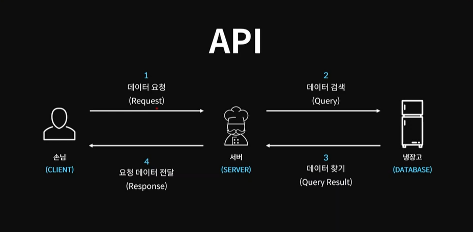

- Truthy
  - [], {}, 숫자, 문자, Infinity
- Falsy
  - null, undefined, 0, -0, NaN, ""

```
const getName = (person) => {
  if (!person) {
    return "객체가 아닙니다.";
  }
  return person.name;
};

let person = { name: "채민지" };
const name = getName(person);
console.log(name);

console.log(getName("")); // 객체가 아닙니다.
console.log(getName(0)); // 객체가 아닙니다.
```


- 삼항 연산자 (조건 ? 참:거짓)

  ```
  // 양수인가 음수인가
  let a = -3;
  a >= 0 ? console.log("양수") : console.log("음수");
  
  // 빈배열인가?
  let b = [];
  b.length === 0 ? console.log('빈 배열') : console.log('안 빈 배열');
  
  const arrayStatus = b.length === 0 ? '빈 배열' : '안 빈 배열';
  console.log(arrayStatus)
  
  // 중첩 삼항 연산자는 쓰지 않는 것을 권장
  // 학점 계산
  // 90 이상 A+, 50 이상 B+, 둘 다 아니면 F
  let score = 40;
  score >= 90 ? console.log("A+") : score >= 50 ? console.log('B+') : console.log('F');
  ```

  

- 단락회로 평가

  - 모든 피연산자와 연산자를 평가하지 않고서도 식의 결과가 결정되는 것

    ```
    console.log(false && true); // false
    console.log(true || false); // true
     
    const getName = (person) => {
      const name = person && person.name;
      return name || "객체가 아닙니다.";
    };
    
    let person = { name: "민지" };
    const name = getName(person);
    console.log(name); // 민지
    console.log(getName('')) // 객체가 아닙니다.
    
    ```

    

- 조건문 응용

  ```
  const meal = {
    한식: "불고기",
    중식: "멘보샤",
    일식: "초밥",
    양식: "파스타",
    인도식: "카레"
  };
  
  const getMeal = (mealType) => {
    return meal[mealType] || "굶기";
  };
  
  console.log(getMeal("중식")); // 멘보샤
  console.log(getMeal("영국식")); // 굶기
  ```

  

- 비 구조화 할당

  ```
  // 배열
  let arr = ["one", "two", "three"];
  
  let [one, two, three, four = "four"] = arr; // 기본값 할당(안하면 undefined)
  console.log(one, two, three, four);
  
  // swap
  let a = 10;
  let b = 20;
  [a, b] = [b, a];
  console.log(a,b); // 20 10 
  
  // 객체
  let object = {
    one: 1,
    two: 2,
    name: "민지"
  };
  
  let { name: myName, one, two, three, four = "4" } = object;
  console.log(one, two, three, four, myName); // 1 2 undefined 4 민지
  ```

  

- Spread 연산자

  ```
  const cookie = {
    base: "cookie",
    madein: "korea"
  };
  
  const chocochipCookie = {
    ...cookie,
    toping: "chocochip"
  };
  
  // 합치기
  const num12 = [1, 2];
  const num46 = [4, 5, 6];
  
  const number = [...num12, 3, ...num46];
  
  console.log(number); // [1,2,3,4,5,6]
  ```

  

- 동기 & 비동기

  - 동기 : 코드가 작성한 순서대로 작업을 처리

    - 단점 : 하나의 작업이 너무 오래 걸리게 될 시, 모든 작업이 오래 걸리는 하나의 작업이 종료되기 전 까지 올 스탑 되기 때문에, 전반적인 흐름이 느려진다.
      - 자바스크립트는 싱글 쓰레드

  - 비동기 : 여러개 작업을 동시에 실행시킴

    ```
    function taskA(a, b, cb) {
      setTimeout(() => {
        const res = a + b;
        cb(res);
      }, 3000);
    }
    
    function taskB(a, cb) {
      setTimeout(() => {
        const res = a * 2;
        cb(res);
      }, 1000);
    }
    
    function taskC(a, cb) {
      setTimeout(() => {
        const res = a * -1;
        cb(res);
      }, 2000);
    }
    
    taskA(3, 4, (res) => {
      console.log("A TASK RESULT : ", res);
    });
    taskB(3, (res) => {
      console.log("B TASK RESULT : ", res);
    });
    taskC(3, (res) => {
      console.log("C TASK RESULT : ", res);
    });
    console.log("코드 끝");
    
    // 결과
    코드 끝
    B TASK RESULT : 6
    C TASK RESULT : -3
    A TASK RESULT : 7
    ```

    

- 콜백 지옥

  ```
  taskA(4, 5, (a_res) => {
    console.log("A RESULT : ", a_res);
    taskB(a_res, (b_res) => {
      console.log("B RESULT : ", b_res);
      taskC(b_res, (c_res) => {
        console.log("C RESULT : ", c_res);
      });
    });
  });
  // 결과
  A RESULT : 9
  B RESULT : 18
  C RESULT : -18
  ```

- 비동기 작업이 가질 수 있는 3가지 상태

  - Pending(대기 상태)
    - Fulfilled(성공)
    - Rejected(실패)


- 실행자 executor

  ```
  function isPositive(number, resolve, reject) {
    setTimeout(() => {
      if (typeof number === "number") {
        resolve(number >= 0 ? "양수" : "음수");
      } else {
        reject("주어진 값이 숫자형 값이 아닙니다.");
      }
    }, 3000);
  }
  isPositive(
    [],
    (res) => {
      console.log("성공적으로 수행됨 : ", res);
    },
    (err) => {
      console.log("실패 하였음 : ", err);
    }
  );
  
  //
  function isPositiveP(number) {
    const executor = (resolve, reject) => {
      // 실행자
      setTimeout(() => {
        if (typeof number === "number") {
          resolve(number >= 0 ? "양수" : "음수");
        } else {
          reject("주어진 값이 숫자형 값이 아닙니다.");
        }
      }, 3000);
    };
    const asyncTask = new Promise(executor);
    return asyncTask;
  }
  
  const res = isPositiveP("");
  res
    .then((res) => {
      console.log("작업 성공 : ", res);
    })
    .catch((err) => {
      console.log("작업 실패 : ", err);
    });
  ```


- 콜백지옥 해결 -> Promise 비동기

  ```
  function taskA(a, b) {
    return new Promise((resolve, reject) => {
      setTimeout(() => {
        const res = a + b;
        resolve(res);
      }, 3000);
    });
  }
  
  function taskB(a) {
    return new Promise((resolve, reject) => {
      setTimeout(() => {
        const res = a * 2;
        resolve(res);
      }, 1000);
    });
  }
  
  function taskC(a) {
    return new Promise((resolve, reject) => {
      setTimeout(() => {
        const res = a * -1;
        resolve(res);
      }, 2000);
    });
  }
  
  taskA(3, 10)
    .then((a_res) => {
      console.log("A RESULT : ", a_res);
      return taskB(a_res);
    })
    .then((b_res) => {
      console.log("B RESULT : ", b_res);
      return taskC(b_res);
    })
    .then((c_res) => {
      console.log("C RESuLT : ", c_res);
    });
    
  // 결과
  A RESULT : 13
  B RESULT : 26
  C RESULT : -26
  ```

  

- async & await - 직관적인 비 동기 처리 코드 작성하기

  - async : Promise를 return, 비동기, .then()사용 가능

  - await : 동기처럼 작동, await 뒤에 있는 함수가 끝날 때까지 다른 일 안함 (async 붙은 함수 내에서만 사용 가능)

    ```
    function hello() {
      return "hello";
    }
    console.log(hello()); // hello
    
    // 대기시간 발생
    function delay(ms) {
      return new Promise((resolve) => {
        setTimeout(resolve, ms);
      });
    }
    
    async function helloAsync() {
      // return delay(3000).then(() => {
      //   return "hello Async";
      // });
      await delay(3000);
      return "hello async";
    }
    
    console.log(helloAsync()); // Promise {<pending>}
    helloAsync().then((res) => {
      console.log(res);
    }); // hello Async
    
    async function main() {
      const res = await helloAsync();
      console.log(res);
    } // hello async
    
    main(); // hello async
    ```

    

- API & fetch

  

  https://jsonplaceholder.typicode.com/ : 오픈 API

  ```
  async function getData() {
    let rawResponse = await fetch("https://jsonplaceholder.typicode.com/posts");
    let jsonResponse = await rawResponse.json();
    console.log(jsonResponse);
  }
  getData();
  ```

  